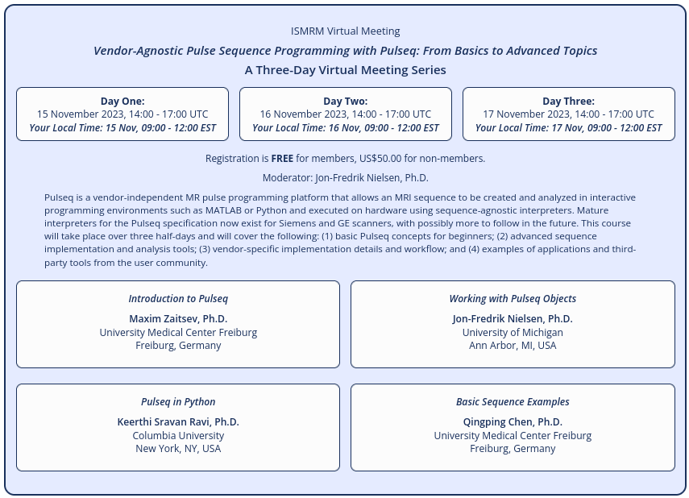

Thank you for your interest in the 'TOPPE' Pulseq interpreter for GE MRI scanners!

To be added to the 
[EPIC source code repository](https://github.com/jfnielsen/TOPPEpsdSourceCode),
please fill out this
[Google form](https://docs.google.com/forms/d/e/1FAIpQLSfzvbVp77zd8eOLx1h4vMTqKcdDXSoulg7mL_y_PB0bgX18sw/viewform?usp=sf_link).
(If you do not receive a Github invite after a day or two, please contact jfnielse@umich.edu).

# News

**Nov 2023: Pulseq course**  
Please join us for a 3-day Pulseq course Nov 15-17, 2023:

**Sep 2023:**
TOPPE has been almost completely rewritten to make it a more accurate
interpreter of Pulseq files.
Please see the **Pulseq on GE manual** for more information.
To view a redacted version of that manual that contains minimal GE specific information, click 
[this link](https://drive.google.com/file/d/1ejtXJfAWdNzXjMlz4Jo3KjVQU6BwGd5g/view?usp=drive_link).
If your institution owns a GE MRI scanner you can obtain the unredacted version of the manual on gecares.com
(look for a post by Jon-Fredrik Nielsen in the MR Software Sharing forum on gecares.com),
or contact Jon-Fredrik Nielsen at jfnielse@umich.edu.

We now recommend that you design your sequence in
[Pulseq](http://pulseq.github.io/), and then convert the .seq file to a .tar
file that can be run on a GE scanner with the TOPPE interpreter.
The manual describes how to perform this conversion.

As a result, most of the information on this page is obsolete,
and has been removed.

The interpreter (EPIC source code) is hosted in a
[separate repository](https://github.com/jfnielsen/TOPPEpsdSourceCode) -- for access, 
fill out this
[Google form](https://docs.google.com/forms/d/e/1FAIpQLSfzvbVp77zd8eOLx1h4vMTqKcdDXSoulg7mL_y_PB0bgX18sw/viewform?usp=sf_link),
or just send an email to jfnielse@umich.edu.

<!--
## Additional information

Additional details and instructions are provided in 
[this MRM paper](http://onlinelibrary.wiley.com/doi/10.1002/mrm.26990/full)
and in the 
[TOPPE Matlab toolbox respository](https://github.com/toppeMRI/toppe/).  
For detailed information about the various files involved,
see the file [Files.md](https://github.com/toppeMRI/toppe/) in the Matlab repo.
-->

<dl>
<!-- This is a comment -->
</dl>

<!--
## Discussion forum

<https://groups.google.com/forum/#!forum/mr-pulse-sequence-prototyping-with-toppe>
-->

<!--
<https://github.com/toppeMRI/toppemri.github.io/wiki>

<https://github.com/orgs/toppeMRI/teams/discussion-forum>

The discussion forum is set up as a Github 'team'. To become a member of the discussion forum team, email your Github user name to Jon-Fredrik Nielsen at <jfnielse@umich.edu> or <jfnielsen@gmail.com>.
-->
